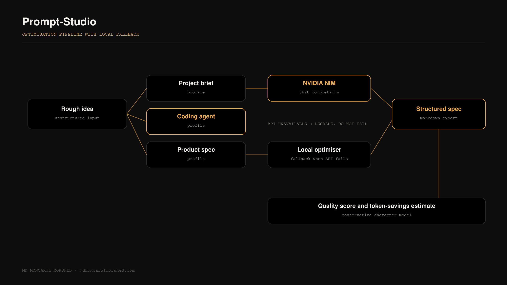
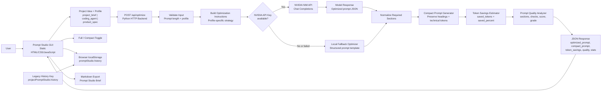

# Prompt Studio

Prompt Studio is a lightweight local web application that transforms rough software project ideas into structured, implementation-ready prompts for AI coding assistants.

It helps users move from a vague idea to a professional build specification with clear objectives, implementation phases, runtime expectations, testing requirements, acceptance criteria, and done-when conditions. The app also generates a compact prompt version and shows the estimated percentage of tokens saved.

## Architecture



A rough idea enters, one of three profiles shapes it, and a structured specification
comes out. The important decision is the lower path: the local optimiser was built before
the remote one, so when the NVIDIA NIM call fails, times out, or is rate limited, the tool
degrades instead of erroring. The remote model is an enhancement to a pipeline that
already works, not the pipeline itself.

Token savings are reported as a conservative character-based estimate and labelled as an
estimate, because a number the user cannot verify is worse than no number.

## Overview

Writing a good prompt for an AI coding assistant is often harder than it looks. A weak prompt can lead to incomplete code, missing edge cases, unclear workflows, and wasted tokens.

Prompt Studio solves this by turning a rough project idea into a stronger project prompt using a phased build-spec strategy. It is built as a simple local tool with a Python backend, static frontend, NVIDIA NIM integration, local fallback optimizer, token-saving compact mode, browser history, and Markdown export.

## Key Features

- Convert rough project ideas into professional implementation prompts.
- Choose from three optimization profiles:
  - `Project Brief`: balanced product and engineering brief.
  - `Coding Agent`: phased execution prompt for AI coding assistants.
  - `Product Spec`: product-facing specification with strategy, risks, milestones, and acceptance criteria.
- Use NVIDIA NIM Chat Completions as the active AI provider.
- Fall back to a local structured optimizer if the API key is missing or the provider fails.
- Generate both full and compact prompt versions.
- Show estimated token savings percentage in the GUI.
- Analyze prompt quality with score, grade, required section coverage, and validation checks.
- Save recent generations in browser localStorage.
- Migrate old browser history from `projectPromptStudio.history` to `promptStudio.history`.
- Export generated prompts as Markdown.
- Run locally with no database, no frontend build step, and no required JavaScript framework.

## Prompt Strategy

Prompt Studio generates prompts with a structured build-spec format. The optimized prompt includes sections such as:

- Role
- Project Context
- Pre-Build Instructions
- Objective
- Project Identity
- Target Users
- Core Features
- User Flow
- Technical Requirements
- Runtime and Configuration
- UI/UX Requirements
- Data, API, and Integration Requirements
- Reference and Research Protocol
- Constraints and Assumptions
- Critical Constraints
- Deliverables
- Implementation Phases
- Startup and Run Sequence
- Testing and Validation
- Acceptance Criteria
- Done When
- Execution Protocol
- Input

Compact mode preserves important Markdown headings, code blocks, inline code, URLs, paths, API names, and technical identifiers while reducing verbose prose.

## Tech Stack

- Backend: Python HTTP server
- Frontend: HTML, CSS, JavaScript
- AI Provider: NVIDIA NIM Chat Completions API
- HTTP Client: `requests`
- Storage: Browser localStorage
- Export Format: Markdown

## Project Structure

```text
.
├── prompt_app/
│   ├── index.html
│   ├── style.css
│   └── app.js
├── prompt_optimizer.py
├── requirements.txt
├── .env.example
├── .gitignore
└── README.md
```

## System Architecture



## Getting Started

### 1. Clone the Repository

```bash
git clone https://github.com/MORSHEDMDMONOARUL/Prompt-Studio.git
cd Prompt-Studio
```

### 2. Create a Virtual Environment

Windows PowerShell:

```powershell
python -m venv .venv
.\.venv\Scripts\Activate.ps1
```

macOS/Linux:

```bash
python -m venv .venv
source .venv/bin/activate
```

### 3. Install Dependencies

```bash
python -m pip install -r requirements.txt
```

### 4. Configure Environment Variables

Create a `.env` file in the project root:

```text
NVIDIA_API_KEY=your-nvidia-api-key
```

Optional settings:

```text
NVIDIA_MODELS=nvidia/nvidia-nemotron-nano-9b-v2,meta/llama-3.1-8b-instruct,nvidia/llama-3.1-nemotron-nano-8b-v1
PROMPT_MAX_CHARS=12000
```

Do not commit your `.env` file or real API keys to GitHub.

### 5. Run the App

```bash
python prompt_optimizer.py --port 8765
```

Open the app in your browser:

```text
http://127.0.0.1:8765/
```

## Usage

1. Enter a rough project idea.
2. Select an optimization profile:
   - Project Brief
   - Coding Agent
   - Product Spec
3. Click `Generate Brief`.
4. Review the generated implementation prompt.
5. Switch between `Full` and `Compact` mode.
6. Check the token savings percentage.
7. Copy or export the generated prompt as Markdown.
8. Restore previous generations from the history panel when needed.

## API Reference

### Get Runtime Config

```http
GET /api/config
```

Example response fields:

```json
{
  "app_name": "Prompt Studio",
  "endpoint": "nvidia-nim",
  "strategy": "phased-build-spec",
  "max_prompt_characters": 12000
}
```

### Optimize a Prompt

```http
POST /api/optimize
Content-Type: application/json
```

Request body:

```json
{
  "prompt": "Build a donor matching app for blood donation coordinators.",
  "profile": "project_brief"
}
```

Supported profile values:

```text
project_brief
coding_agent
product_spec
```

Response fields include:

```text
optimized_prompt
compact_prompt
token_savings
quality
stats
profile
source
model
```

## Token Savings

Prompt Studio estimates token usage with a conservative character-based method. Compact mode reduces prompt length by trimming prose while preserving important technical content.

The response includes:

```text
token_savings.full_tokens
token_savings.compact_tokens
token_savings.saved_tokens
token_savings.saved_percent
```

## Fallback Behavior

If the NVIDIA API key is missing or the provider request fails, Prompt Studio uses a local fallback optimizer. The fallback still returns the same public response fields, including:

- `optimized_prompt`
- `compact_prompt`
- `token_savings`
- `quality`
- `stats`

This keeps the app usable during local testing even without an active API key.

## Validation

Run a quick Python syntax check:

```bash
python -m py_compile prompt_optimizer.py
```

Optional API smoke test after starting the server:

```bash
curl -X POST http://127.0.0.1:8765/api/optimize \
  -H "Content-Type: application/json" \
  -d "{\"prompt\":\"Build a student study tracker app.\",\"profile\":\"coding_agent\"}"
```

## Security Notes

- Keep `.env` private.
- Do not upload real API keys to GitHub.
- Use environment variables for provider credentials.
- The app stores prompt history only in the browser through localStorage.
- No database is used.

## Future Improvements

- Add optional authentication for shared deployments.
- Add more provider integrations.
- Add downloadable system diagram output.
- Add richer token estimation with provider-specific tokenizer support.
- Add optional automated prompt comparison reports.

## License

This project is prepared for academic and portfolio use. Add a license file before using it in production or distributing it broadly.

---

## Author

**MD Monoarul Morshed** — AI & Edge Computing Engineer based in Seoul, South Korea.
Computer Science graduate (Sejong University, 2026) and Teaching Assistant, working on
trustworthy computer vision, edge AI, post-quantum cryptography, and security-first
agentic systems.

- Portfolio — [mdmonoarulmorshed.com](https://mdmonoarulmorshed.com)
- Notes — [mdmonoarulmorshed.com/blog](https://mdmonoarulmorshed.com/blog)
- GitHub — [@MORSHEDMDMONOARUL](https://github.com/MORSHEDMDMONOARUL)
- LinkedIn — [md-monoarul-morshed](https://www.linkedin.com/in/md-monoarul-morshed-6a07a6263)
